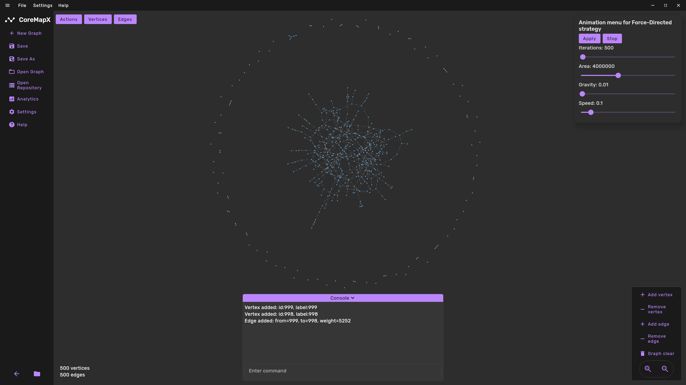

# ***CoreMapX***

<div align="center" style="margin: 20px 0;">
    
</div>

This is a Kotlin desktop application for analyzing and visualizing graphs on a plane.
Supported graph types:

+ **GRAPH** - Custom text-based format
+ **JSON** - Standard JSON format
+ **SQL DB** - SQLite database format

Supported layout strategies:

+ **Random** - Places vertices randomly
+ **Circular** - Arranges vertices in a circle
+ **Force-Directed** - Uses physics-based layout algorithm

Supported pathfinding strategies:

+ **BFS** - Breadth-First Search algorithm
+ **Dijkstra** - Dijkstra's shortest path algorithm
+ **Bellman Ford** - Bellman-Ford algorithm for graphs with negative weights

## ***Technologies***

+ JVM 21.0.8
+ Groovy 3.0.17
+ Gradle 8.7
+ Kotlin 1.9.22
+ Compose 1.6.10
+ Logback 1.5.13
+ Flatlaf 3.2.5
+ Sqldelight 2.1.0
+ JUnit5 with Vintage 5.10.1 for JUnit4 4.13.2
+ Mockk 1.13.10
+ and others...

## ***Features***

+ Interactive graph editing via the command line interface
+ Highly customizable user interface (Interface colors, fonts, etc.)
+ Support for multiple languages (English, Russian and custom languages)
+ The ability to generate random graphs
+ Configuration management



## ***Usage***

### ***Quick start***

+ Download the repository from GitHub via ssh or https:

    ``` bash
    git clone https://github.com/vvmaksim/CoreMapX.git
    ```

    or

    ``` bash
    git clone git@github.com:vvmaksim/CoreMapX.git
    ```

+ Move to the downloaded project directory

    ``` bash
    cd CoreMapX/
    ```

+ Launch the application with the command

    ``` bash
    ./gradlew run
    ```

    or

    Launch the application by running the file `app/src/main/kotlin/org/coremapx/app/Main.kt` (for example via IDEA)

+ To test the functionality, you can initialize a new graph and generate a random one.
  
    To do this, press the following buttons in the UI:

    **`New Graph`** -> **`Actions`** -> **`Generate Random Graph`**

### ***Important***
**Before using the application, it is worth reading the background information that you can find in the main menu of the application. 
It tells you more deeply about the intricacies of CoreMapX.**

### ***Graph Formats***

The application supports three different graph storage formats, each with its own extension and structure.

#### ***GRAPH*** (.graph)

Graphs in this format are saved with an extension **`.graph`**.

The graph in this format is a text file with a specific structure. Two blocks are required: **`Info`** and **`Graph`**.

Two parameters are required in the **`Info:`** block: **`isDirected`** and **`isWeighted`**. But, if possible, it is better to specify all the data.

In the **`Graph:`** block, the graph is stored as a set of commands (they will be described in the README file below). Only the add (vertex or edge) commands are allowed.

Example:

``` graph
Info:
name=Graph Name
author=Patrick Bateman
isDirected=true
isWeighted=true

Graph:
add vertex 0 label_for_vertex_0
add vertex 1 label_for_vertex_1
add edge 0 1 52
```

#### ***JSON*** (.json)

Graphs in this format are saved with an extension **`.json`**.

This format represents the graph as a structured JSON document with separate sections for metadata (info) and graph elements (vertices and edges).

Example:

``` json
{
    "info": {
        "name": "Graph Name",
        "author": "Patrick Bateman",
        "isDirected": true,
        "isWeighted": true
    },
    "graph": {
        "vertices": [
            {
                "id": 0,
                "label": "label_for_vertex_0"
            },
            {
                "id": 1,
                "label": "label_for_vertex_1"
            }
        ],
        "edges": [
            {
                "from": 0,
                "to": 1,
                "weight": 52
            }
        ]
    }
}
```

#### ***SQL DB*** (.db)

Graphs in this format are saved with an extension **`.db`**.

This format uses a SQLite database with three tables:

+ `graphs` - Contains graph metadata
+ `vertices` - Contains vertex data
+ `edges` - Contains edge data

The database is designed in such a way that it can store several graphs at once. To open a graph that is stored in a database, you need to open it as a repository, and then select the graph from the database that you need.

## ***User Directory***

The user directory is created in the home directory. The path differs depending on the operating system:

+ For Windows: `C:\Users\UserName\.coremapx`
+ For UNIX-like systems: `/home/UserName/.coremapx`

**Do not edit configuration files while the application is running**, as this may lead to **errors**. It is better to change the config in the application settings (When changing a parameter by writing a new value through the text field, press **`Enter`** to confirm that the parameter value has been saved).

Graphs are saved in the `.coremapx/data/graphs` directory by default.

## ***Commands***

You can interact with the graph through commands. Each command looks like this:
`<Type> <Object> <Parameters>`

For example: `add vertex 1 label_1` or `set strategy circular`

**Supported command types:**

+ `add` - Add elements to the graph
+ `rm` or `remove` - Remove elements from the graph
+ `set` - Set application parameters
+ `clear` - Clear the command output or completely clear the graph
+ `help` - A little help on commands

**Supported command entities:**

+ `vertex`
+ `edge`
+ `strategy`

**Supported command parameters:**

+ For vertex: `id` (Long) and `label` (String)

  ``` CoreMapX console
  add vertex 1 VertexLabel
  add vertex id:2 label:AnotherVertex
  ```

+ For edge: `from` (vertex id) and `to` (vertex id). If graph is weighted, also `weight` (Int)

  ``` CoreMapX console
  add edge 1 2
  add edge from:1 to:2 weight:10
  ```

+ For strategy: strategy(Random, Circular or Force-Directed)

  ``` CoreMapX console
  set strategy Force-Directed
  ```

The command parameters can be specified explicitly or implicitly. If the form is implicit, then they should be specified in strict order. If it is explicit, then you can specify the parameters in any order.

Here are some commands for example:

``` CoreMapX console
add vertex label:someLabel1 id:52 // Explicit
add vertex 52 someLabel1 // Implicit
add edge from:1 to:2 weight:52 // If graph is weighted
add edge from:1 to:2 // If graph is unweighted
clear // Clear console
graph_clear // Complete clearing of the graph
set strategy Force-Directed // Set layout strategy on Force-Directed
```

Commands can be written one after the other using the separator `;`:

``` CoreMapX console
add vertex 1 1; add vertex 2 2; add edge 1 2
```

## ***Languages***

The application initially supports two languages: **`English`** and **`Russian`**. However, you can change the `.coremapx/config/custom_language.lang` file that is created when the application is first launched. In it, you can translate any text element of the application (with the exception of error messages) into any language. After that, you will need to change the language of the application in its settings.

## ***License*** :clipboard:

This project is licensed under the [Apache License](LICENSE)
